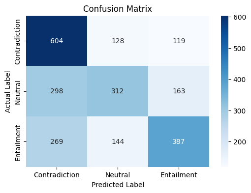

# Sentence Contradiction Classification

## Project Overview

This project focuses on classifying sentence pairs into three categories: **Contradiction, Neutral, or Entailment**. The model is based on **BERT (Bidirectional Encoder Representations from Transformers)** for sequence classification. The dataset consists of labeled sentence pairs, and the goal is to train a model that can accurately determine the relationship between two given sentences.

## Dataset Description

The dataset used in this project contains pairs of sentences labeled as:

- **Contradiction (0)**: The two sentences contradict each other.
- **Neutral (1)**: There is no clear relationship between the sentences.
- **Entailment (2)**: One sentence logically follows from the other.

The dataset is stored as a CSV file and includes the following columns:

- `premise`: The first sentence.
- `hypothesis`: The second sentence.
- `label`: The relationship category (0, 1, or 2).

## Model Implementation Details

- **Preprocessing**: Data cleaning is performed by removing special characters and converting text to lowercase.
- **Tokenization**: BERT tokenizer is used to prepare the text for model training.
- **Model**: A pre-trained **BERT** model (`BertForSequenceClassification`) fine-tuned for classification.
- **Optimizer**: AdamW optimizer with learning rate scheduling.
- **Loss Function**: CrossEntropyLoss for multi-class classification.

## Steps to Run the Code

1. Install dependencies:
   ```bash
   pip install torch transformers scikit-learn pandas matplotlib seaborn
   ```
2. Load and preprocess the dataset.
3. Tokenize the text using the BERT tokenizer.
4. Train the BERT model on the dataset.
5. Evaluate the model on the test set.
6. Analyze results using classification metrics and confusion matrix.

## Model Evaluation Results

The model is evaluated using:

- **Accuracy Score**
- **Classification Report (Precision, Recall, F1-Score)**
- **Confusion Matrix**

### Evaluation Metrics

- **Model Accuracy**: 0.5375

**Classification Report:**

```
               precision    recall  f1-score   support

           0       0.52      0.71      0.60       851
           1       0.53      0.40      0.46       773
           2       0.58      0.48      0.53       800

    accuracy                           0.54      2424
   macro avg       0.54      0.53      0.53      2424
```

**Confusion Matrix:**

The confusion matrix visualizes the performance of the model across different classes.



Performance results will vary based on hyperparameter tuning and dataset size.

## Additional Observations

- Data imbalance may impact model performance.
- Fine-tuning BERT requires substantial computational resources.
- Further improvements can be achieved using data augmentation and hyperparameter tuning.

This README provides an overview of the project, dataset, model implementation, and evaluation procedures. Adjustments can be made based on experimental findings to improve classification performance.

